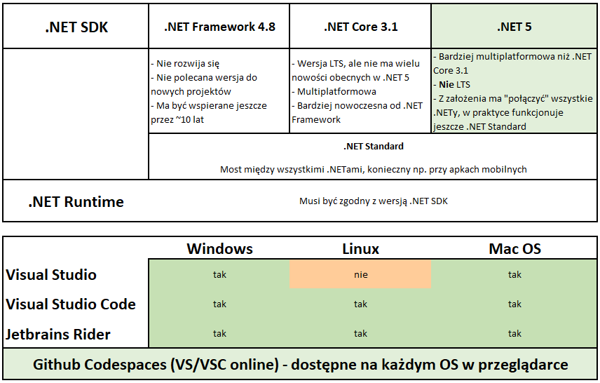

# Jak zacząć
Żeby zacząć pracę w .NET w dowolnym systemie (Windows, Linux, Mac OS) trzeba zainstalować w systemie .NET SDK i .NET Runtime.
Dla Windowsa jeśli chcemy pracować w Visual Studio to instalator prawdopodobnie sam podpowie instalację tych składników. W przypadku VSC trzeba jednak te składniki zainstalować ręcznie.

# Struktura programu
W .NET mamy koncepcję solucji i projektu - solucja scala wiele projektów. Nie powiedziałem tego w prezentacji, ale w przypadku prostego programu i pracy w VSC możemy utworzyć pojedynczy projekt bez solucji i powinno działać (na potrzeby testów można tak pracować, przy poważniejszym programie lepiej "po bożemu" stworzyć jednak solucję i dołączyć do niej projekt(y).
# Praca w konsoli
Niezależnie od systemu jeśli chcemy pracować w VSC lub nawet w notatniku, po zainstalowaniu .NET SDK i .NET Runtime mamy do dyspozycji tzw. CLI (Command Line Interface). Aktywujemy go poleceniem <b>dotnet</b>. Aby dostać listę dostępnych opcji uruchamiamy <b>dotnet --help</b>.
# Tworzenie struktury programu
Zaczynamy od utworzenia struktury folderów. Root folder to folder solucji. Jego podfoldery to foldery projektów. Nazwy folderów nadajemy takie jak mają się nazywać odpowiednio solucja i projekty.
W poszczególnych folderach używamy polecenia <b>dotnet new</b> (<b>dotnet new -l</b> dla listy dostępnych szablonów projektów/solucji). W rootfolderze wpisujemy <b>dotnet new sln</b> aby utworzyć solucję. W podfolderach np. <b>dotnet new console</b> dla aplikacji konsolowej lub <b>dotnet new classlib</b> dla biblioteki. Na koniec dodajemy projekty do solucji przechodząc do root folderu i używając polecenia <b>dotnet sln add <i>sciezka_pliku_csproj</i></b> tyle razy ile mamy projektów.
